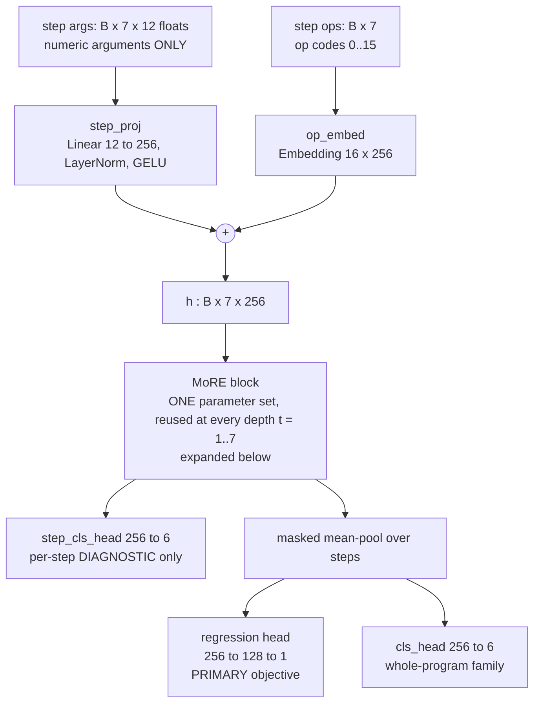
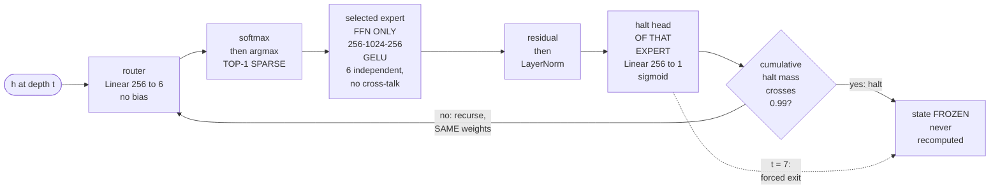

# Mixture of Recursive Experts (MoRE)

PyTorch implementation and experimental record for **MoRE**, an architecture that
composes two mechanisms that are normally studied separately:

- **MoE** — multiple independent expert FFNs with learned **Top-1 sparse** token
  routing. Answers *which computation module?*
- **MoR** — one shared block reused across recursion steps with adaptive halting.
  Answers *how much computation?*
- **MoRE** — a token is routed to a specialized expert, and that expert's weights are
  recursively reused for an adaptively halted number of steps. Answers both.

The research question is whether the *composition* buys anything that neither
component gives alone.

> ### Headline finding: it did not.
>
> On this task at this scale, MoRE is statistically indistinguishable from MoE and
> significantly worse than MoR. The halting mechanism is mechanically real —
> differentiable, gradient-carrying, early-exiting on 99.97% of tokens — and its
> *behaviour* is beaten by a policy that ignores its input and emits a constant.
> This is [CLAUDE.md](CLAUDE.md) §8 **Outcome C**, and it is the result, not a
> setback. Full evidence and limitations: **[results/results.md](results/results.md)**.

### Two tasks, and this page is mostly about the first one

The repository now runs the same engine on two tasks, selected by one field:

| `task` | data | target | status |
| :--- | :--- | :--- | :--- |
| `arithmetic` (default) | synthetic `more6-v1`, 70,000 programs | one regressed scalar, **mean squared error** | complete — the Outcome C above |
| `language` | WikiText-103, BPE-8192, packed to 256 tokens | next token, **per-token cross-entropy in nats** | protocol frozen; canonical matrix pending |

**The headline finding above is the arithmetic result and says nothing about
language.** The two primary metrics are an MSE and a cross-entropy; they may never
appear in one table ([CLAUDE.md](CLAUDE.md) §6) and the exporter refuses to combine
them. Whether an Outcome C on a 70,000-program synthetic regression predicts anything
about a 135 M-token language model is exactly the open question, and the reason the
language study exists rather than being inferred.

Absence of a `task` key **means arithmetic**. That is not laziness: it is what keeps
all 15 published arithmetic `config_hash` values, and therefore every canonical run's
identity, unchanged by the language work.

The language quickstart is §6; the corpus is §3b. If you are here to *run* the
language matrix, read [SETUP.md](SETUP.md) then [HANDOFF.md](HANDOFF.md) instead —
they are written for that job and this file is not.


---

## 1. Results in short

Five seeds (42–46), 50 epochs, matched ~3.2 M parameters, synthetic `more6-v1`
arithmetic task. Primary metric is last-epoch validation **task** loss — never
`total_loss`. Reading rule is an exact two-sided randomization test on the difference
of means (`code/seed_stats.py`), reported with the smallest p the sample sizes can
produce.

| architecture | `val/task_loss` | R² vs predict-mean floor | params |
| :--- | :---: | :---: | :---: |
| MoE | 0.063260 ± 0.000153 | 0.2182 | 3,201,555 |
| **MoR** | **0.062706 ± 0.000112** | **0.2250** | 3,197,710 |
| MoRE | 0.063186 ± 0.000249 | 0.2191 | 3,201,555 |

- MoR beats MoE (d = 4.13, p = 0.0079) and beats MoRE (d = 2.49, p = 0.0159).
- MoRE vs MoE is unresolved (d = −0.36, p = 0.6587). MoE *is* MoRE at
  `max_depth = 1` with identical parameter tensors, so this contrast isolates
  computation from capacity.
- Every arm explains only 21.8–22.5% of held-out target variance. The entire
  between-architecture spread is ~3% of what any one arm explains — the task, not the
  architecture, is the binding constraint here.

### Adaptive depth is mechanically present and behaviourally near-constant

Both recursive arms place 93–97% of tokens at exactly 2 recursion steps. The decisive
test is against the **best constant-depth policy** (`code/depth_null_model.py`), which
scores held-out absolute depth allocation error **0.8703 at c = 2.00**:

| | held-out depth | abs. allocation error | vs best constant |
| :--- | :---: | :---: | :---: |
| MoR | 2.1283 ± 0.0188 | 0.9423 ± 0.0266 | **+8.3% worse**, 5/5 seeds lose |
| MoRE | 2.3531 ± 0.1087 | 0.9940 ± 0.1054 | **+14.2% worse**, 5/5 seeds lose |

Two ablations agree independently: forcing all 7 steps for every token gives *better*
loss at indistinguishable throughput (p = 0.0476, nominal only under a family-wise
correction), and weakening the ponder cost 10× raises depth without improving loss.

### Expert specialization is real, and is not a proxy for quality

Under permutation-invariant measurement (expert indices carry no semantic identity),
Hungarian-matched routing accuracy is 0.5004 ± 0.0560 (MoE) and 0.5258 ± 0.0612 (MoRE)
against 6-way chance 0.1667, with balanced load and no collapse. Roughly 72–80% of the
partition survives removing the only oracle-derived loss term. But supervising the
router directly drives every routing metric to exactly 1.0000 ± 0.0000 **while making
task loss significantly worse** — so routing quality must never be quoted as evidence
of architectural quality.

### What bounds all of this

3.2 M parameters on one laptop GPU; one synthetic dataset with a hand-authored depth
curriculum and hand-assigned expert families; one scalar regression objective, one
split, and a single shared hyperparameter setting that was **not** swept per
architecture. These bound the *conclusion*; they are not offered as reasons MoRE
deserved better. [results/results.md](results/results.md) §19 states what would change
the verdict.

---

## 2. Architecture

One training system with an explicit `--architecture {moe,mor,more}` switch — not
three codebases. All three modes instantiate the same `MoREModel`; the mode only sets
`num_experts`, `max_depth` and `adaptive_halting`. That is what makes the comparison a
comparison of *mechanisms* rather than of implementations.

**The data path.** One block, three heads; only the regression head is the objective.



**Inside the block — where both mechanisms live.** The horizontal chain is *which
expert*; the backward edge is *how much depth*. Both decisions are made per token, and
the loop reuses the identical weights.



**What the three modes are, in exactly these terms:**

| | `num_experts` | `max_depth` | `adaptive_halting` | `ffn_mult` | params |
| :--- | :---: | :---: | :---: | :---: | ---: |
| MoE | 6 | **1** | no | 4 | 3,201,555 |
| MoR | **1** | 7 | yes | **24** | 3,197,710 |
| MoRE | 6 | 7 | yes | 4 | 3,201,555 |

MoE is *exactly* MoRE at `max_depth = 1`, down to identical parameter tensors —
`adaptive_halting` is not a constructor argument, so the six halt heads are allocated
under `architecture=moe` too and simply never receive gradient. **MoRE-vs-MoE is
therefore an exact isolation of recursion at fixed capacity.** MoR's `ffn_mult = 24`
is not a tuned value: it is `4 × 6`, equalising *total* FFN hidden width against
MoRE's six experts. The residual 0.120% gap is the router plus the six halt heads
plus FFN biases, it is irreducible at any integer multiplier, and it runs **against**
the headline result — MoR wins with fewer parameters, so capacity cannot be the
explanation.

**Five mechanics that the numbers depend on:**

- **Weight sharing is real.** Depth is the *same* `MoEBlock` applied again, not a
  stack of depth-specific layers. Recursion adds compute, never parameters.
- **Routing is Top-1 sparse.** `Linear → softmax → argmax → dispatch to that expert
  alone`. Dense evaluate-all-and-blend exists only as a labelled ablation, and it
  measures significantly worse (§1).
- **Halting is ACT / Universal-Transformer style,** threshold `1 − ε` with
  `ε = 0.01` so a genuine one-step exit is reachable. Halted states are frozen and
  not recomputed; there is a forced exit at depth 7; the ponder cost is
  differentiable, so a real gradient reaches the halt heads.
- **Halt heads are per-expert**, one `Linear(256, 1)` each — the design intent was
  that E1 ADD/SUB learns to exit fast while E6 SORT/STAT learns to recurse. It is
  measurably not what happened (§1).
- **The balance loss is normalized** so its magnitude does not grow with recursion
  depth or block count, and it is never the primary objective. It is reported
  decomposed: `routing_balance_loss = switch_aux_term − entropy_term`.

Full call graphs, field-by-field, are in [ARCHITECTURE.md](ARCHITECTURE.md) §1–§3.

## 3. The dataset — `more6-v1`

Synthetic, generated once by [data/script.py](data/script.py) and then **frozen as
three files on disk**, not re-split per run. Every canonical run declares
`dataset_version = more6-v1-seed42-n70000-3c1087b6aad9` and
`train_split_version = fixed-file-splits-v1`; the exporter refuses to put two dataset
versions in one table.

| | programs | share |
| :--- | ---: | :---: |
| `data/train.jsonl` | 59,500 | 85.0% |
| `data/val.jsonl` | 5,250 | 7.5% |
| `data/test.jsonl` | 5,250 | 7.5% |
| **total** | **70,000** | |

Each record is a short **arithmetic program**: a sequence of 1–7 steps over 16
operations, packed to 7 step-tokens. The model regresses one scalar — the program's
final output. Program-key overlap between splits is **0 / 0 / 0**, and all 70,000
programs are unique. Counts per operation, per family and per depth are in
[data/dataset_meta.json](data/dataset_meta.json), together with SHA-256 of each split
file.

**16 operations, 6 expert families** (`code/more/families.py` is the single manifest —
every label in the project derives from it, and an unmapped operation must **raise**,
never fall back; the old E7 catch-all is removed):

| expert | operations |
| :--- | :--- |
| E1 `ADD_SUB` | ADD, SUB |
| E2 `MULT_DIV` | MULT, DIV |
| E3 `MOD_POW` | MOD, POW |
| E4 `LOGIC` | AND, OR, XOR, NOT |
| E5 `SHIFT` | SHIFT_L, SHIFT_R |
| E6 `SORT_STAT` | SORT, MEDIAN, MAX, MIN |

**The depth curriculum is a hand-authored design choice, not a measurement.** It
states how many sequential sub-steps each operation takes under a naive decomposition,
and it is the *only* reference against which "depth allocation error" is computed:

| target depth | operations | rationale |
| :---: | :--- | :--- |
| 1 | ADD, SUB, AND, OR, XOR, NOT, SHIFT_L, SHIFT_R | one primitive machine operation |
| 2 | MULT, DIV, MAX, MIN | one primitive repeated, or one pairwise comparison |
| 3 | MOD, POW | divide-and-remainder, or repeated multiply |
| 4 | SORT, MEDIAN | requires an ordering over all arguments |

Two properties of that table matter for reading any depth number. It is deliberately
**correlated with but not a function of** the expert families — E4 and E5 share depth
1, and E6 spans 2 and 4 — so a model cannot score well on depth by routing alone.
And the mean that governs token-level depth metrics is the **token-weighted 2.1082**,
not the 1.8750 you get by averaging over the 16 operation *types*.

### The input contract, which is where leakage would have lived

Per step, one row of 12 floats holding **only that step's numeric arguments**, each
clamped to ±`max_val` and divided by `max_val`. Three things are deliberately absent:

```text
the step result          — it equals the regression target on the final step
the oracle expert index  — that mapping is exactly what routing must discover
family_id as a feature   — prohibited outright (CLAUDE.md §3)
```

Operation *identity* is legitimate task information, so it is supplied separately as
`step_ops` and consumed by an embedding over **16 operations** — not over experts, so
the embedding table's shape cannot leak the mapping either. The consequence is the
invariant the whole three-way comparison rests on: **the input features are
bit-identical across MoE, MoR and MoRE for the same record.** That is tested, not
asserted — gate 1 passes 8/8 checks, including 0 feature changes under mutating the
step result and 0 under permuting expert indices.

**Read every loss against the floor, never against zero.** Predict-the-train-mean on
the real validation split scores **0.080914**; predict-zero and best-single-feature-copy
both score 0.081853. A result is only meaningful if it beats all three. The reported
`val/task_loss` of ~0.0627–0.0633 is therefore an R² of 0.218–0.225 against that
floor — which is the single most important piece of context for §1's table.

**One redefinition worth knowing.** The generator emits 40% of its mass in an `E7`
slot, which is not a seventh expert but the multi-operation **chain** family. Canonical
MoRE has six experts and routes *per step*, so a chain's steps route to E1–E6
individually. Those records are emitted as `family = MIXED` with whole-program family
index `-1`, a documented ignore label that the classification loss skips — never a
7th class and never a measurement. Dropping them instead would have deleted every
program of depth 4–7 and made adaptive-depth allocation unmeasurable, which is the
phenomenon under study.

---

## 3b. The language corpus — `wikitext-103`

The second task is next-token prediction on English. Nothing about the engine changes;
`task = language` swaps the dataset, the input head and the output head, and the
primary metric becomes **per-token cross-entropy in nats**. Built once by
[data/lang/build_language_dataset.py](data/lang/build_language_dataset.py) and frozen
on disk as `uint16` `.npy` arrays, memory-mapped at load — **not** re-tokenized per run.

| | blocks of 256 | tokens |
| :--- | ---: | ---: |
| train | 526,320 | 134,737,951 |
| validation | 1,098 | 281,335 |
| test | 1,256 | 321,583 |

Splits are **the corpus author's own**, not ours — WikiText-103 ships train/valid/test,
so there is no split seed to get wrong and no possibility of a leak we introduced. A
BPE tokenizer of **vocabulary 8,192** is trained on the training text alone; documents
are separated by `eot_id = 0` and the stream is packed into fixed 256-token blocks,
discarding a tail of 31 / 247 / 47 tokens. Every canonical language run declares
`dataset_version = lang-wikitext-103-bpe8192-len256-800d6154`, which is derived **from
the SHA-256 of the split arrays alone** — so a manifest stage can be rebuilt without
changing any run's identity. A second, much smaller corpus (`wikitext-2`) exists for
development and smoke runs and carries its own `dataset_version`, which is what makes
it structurally incapable of contaminating the canonical matrix.

**Read every language loss against the bigram floor, never against zero — and never
against the arithmetic floor.** Three trivial predictors were fitted on train and
evaluated on validation:

| floor | val nats/token | what it knows |
| :--- | ---: | :--- |
| uniform over the vocabulary | 9.010913 | nothing |
| unigram (add-1) | 7.198227 | token frequency |
| **backoff bigram** (abs. discounting D=0.75) | **4.984947** | the previous token |

`primary_metric_floor = 4.984947` is the one that counts, and each run records its own
margin over it; the exporter re-derives that margin and refuses the export if it does
not reproduce. The dev corpus's floor is 5.398304 — a 0.41 nat gap, **larger than any
architecture difference this study can resolve**, which is precisely why a dev-corpus
number may never sit in a canonical table.

**Six POS families, and they are a prior rather than ground truth** — this is the most
important caveat on this page for reading any language routing number.
[code/more/lang_families.py](code/more/lang_families.py) is the single manifest; the
per-token mapping is built by a majority vote of an NLTK perceptron tagger over
training occurrences, with a surface fallback for numerals and punctuation:

| family | types | train token share |
| :--- | ---: | ---: |
| `L1_FUNCTION` | 243 | 28.2% |
| `L2_NOUN` | 3,495 | 30.0% |
| `L3_VERB` | 839 | 5.8% |
| `L4_MODIFIER` | 658 | 6.6% |
| `L5_PUNCT_SYM` | 38 | 8.8% |
| `L6_NUM_SUBWORD` | 2,743 | 20.7% |

A BPE piece has no part of speech — only whole words do — so 3,508 types are
*contested* across occurrences and 1.23% of training tokens stay `UNMAPPED` (budget:
2%). The partition is therefore a **hypothesis about what a router might find**, not a
label set the router is scored against. Consequently the metric is named
`val/routing_agreement_with_pos` and **never "routing accuracy"**, and the honest
reference point is not 1.0: the partition's own normalized load entropy is
**0.894156** on this corpus, and its largest/smallest family token ratio is 5.17×.
Both are corpus-specific, so each run publishes its own corpus's value as
`val/routing_pos_partition_load_entropy` rather than any document quoting a constant.

Two controls exist so that "routing aligns with grammar" can be falsified rather than
merely asserted. A **shuffled control** (`token_family_shuffled.npy`, 10 draws)
reassigns families at random while matching the real token proportions, giving an
empirical floor for AMI and Hungarian accuracy — alignment counts only if it beats its
own permutation control. And an **induced 6-topic document clustering** provides a
semantic partition independent of syntax. Both are explicitly *not* ground truth, and
the manifest says so in its own `topic_note`.

Two further per-token tables ship with the corpus and are **ablation-only, never
canonical**: a 10-way frequency-decile label (for the supervised-curriculum ablation)
and the topic assignment. Canonical language runs **invent no depth target** — English
has no per-token ground-truth depth, which is why `depth/allocation_error_*` exports as
`N/A` rather than `0.0` on this task. A `0.0` there would read as perfect allocation
against a curriculum that does not exist.

---

## 4. Experiments conducted

| experiment | arms | seeds | epochs | status | artifact |
| :--- | :--- | :---: | :---: | :--- | :--- |
| **Phase B headline matrix** | MoE, MoR, MoRE | 42–46 | 50 | canonical | `code/phase9_matrix_result.json` |
| **Phase 10 ablations** | 6 (below) | 42–46 / 42–44 | 50 | labelled ablation | `automated/phase10_ablations_result.json` |
| Depth null model | best constant depth | — | — | offline analysis | `results/depth_null_model.json` |
| Held-out depth eval | all recursive runs | — | — | offline analysis | `runs/*/val_depth_offline.json` |
| `family_cls` removal | on vs off | 42–44 | 20 | **exploratory proxy** | `automated/family_cls_ablation_result.json` |
| Capacity benchmark | batch and width sweeps | — | — | microbenchmark | `results/bench_capacity.log` |
| Correctness suite | 5 gates, 356 checks | — | — | verification | `code/run_correctness_suite.py` |

The headline matrix is the only thing that enters the main table. `canonical_spec.json`
enforces this: a run may declare `experiment_group = canonical_phase_b` only if every
frozen field matches, it uses the full dataset, and it names a seed from {42,…,46}.
The matrix came back clean — 0 problems, 168 invariant comparisons, and identical
seed-blind configs within each arm.

**The six ablations, each against canonical MoRE on `val/task_loss`.** Family-wise
threshold is Bonferroni α = 0.05/6 = **0.0083**; p comes from an exact two-sided
randomization test, and the resolution floor is 0.0040 at 5-vs-5 and 0.0179 at 3-vs-5:

| ablation | n | Δ vs MoRE | d | p | verdict |
| :--- | :---: | ---: | ---: | ---: | :--- |
| `routing_supervision` | 5 | +0.000565 | +2.89 | **0.0079** | worse; survives Bonferroni |
| `dense_routing` | 5 | +0.000529 | +1.90 | **0.0079** | worse; survives Bonferroni |
| `fixed_depth` | 5 | **−0.000301** | −1.48 | 0.0476 | *better*; **fails** Bonferroni |
| `ponder_cost_low` | 3 | +0.000444 | +1.17 | 0.1607 | direction only |
| `router_noise` | 3 | +0.000176 | +0.53 | 0.4107 | supports no claim |
| `two_blocks` | 3 | +0.000072 | +0.21 | 0.7500 | supports no claim |

Three of these are load-bearing. **`fixed_depth`** forces all 7 steps for every token
and is the sharpest test of the halting mechanism: it fits *better* at
**indistinguishable throughput** (2198 ± 274 vs 2225 ± 274 records/s despite 3.4× the
recursion steps), so learned halting bought neither quality nor wall clock.
**`routing_supervision`** drives every routing metric to exactly 1.0000 ± 0.0000 while
making task loss significantly worse — the oracle partition is perfectly learnable and
learning it hurts, which is why routing quality is never quoted here as evidence of
architectural quality. **`dense_routing`** evaluates all six experts per token, runs
1.37× *faster*, and still scores worse — so the cost at this scale is per-step
gather/scatter, not FFN arithmetic.

`two_blocks` nearly doubles parameters (3,201,555 → 6,358,553) for Δ = +0.000072 at
p = 0.7500. Capacity is not the binding constraint; the task is.

**Two experiments are reported with their own limits attached.** The `family_cls`
removal is a 20-epoch 3-seed **proxy** and is labelled as such everywhere — it shows
72–80% of the routing partition survives removing the only oracle-derived loss term,
which withdraws the unqualified "self-supervised" claim rather than confirming it. And
the capacity benchmark's **width sweep is rejected as unusable**: `d_model = 512` timed
*faster* than 256, violating the benchmark's own printed invariant, from laptop-GPU
clock ramp under too few warmup iterations. Only its batch sweep is kept, and it is a
clean launch-bound signature — 64× the batch costs 2.5× wall clock per step. That
headroom is real and **cannot be used**, because `batch_size` is a hashed config field
and spending it would change every canonical run's identity.

---

## 5. Repository layout

| path | contents |
| :--- | :--- |
| [ARCHITECTURE.md](ARCHITECTURE.md) | **read first** — orientation, the one-engine/three-modes design, data contract, gate status |
| [CLAUDE.md](CLAUDE.md) | operating rules: terminology, hard architectural constraints, metric rules, outcome honesty |
| `code/more/` | the implementation (`config`, `families`, `data`, `model`, `metrics`, `engine`, `run_context`) |
| `code/canonical_spec.json` | the single frozen definition of "canonical"; the guard refuses any run that deviates |
| `code/canonical_spec_language.json` | the same guard for `task = language` — separate file, separate group `canonical_lang_b` |
| `data/` | `more6-v1` as three frozen files plus `dataset_meta.json` (split hashes, counts, leakage audit) and the generator |
| `data/lang/<corpus>/` | the language corpora as frozen `.npy` arrays plus their own `dataset_meta.json`; `wikitext-103` is canonical, `wikitext-2` is dev-only |
| [SETUP.md](SETUP.md) / [HANDOFF.md](HANDOFF.md) | clone-to-first-run setup, and the operating instructions for whoever drives the language matrix |
| `results/` | `results.md` (the narrative) plus machine-generated `results.csv` / `.json` / `results_tables.md`, `depth_null_model.json`, `bench_capacity.log` |
| `results/language/` | the same artifacts for the language task, written only by `export_results.py --task language` |
| `runs/<experiment_id>/` | per-run outputs only — config, resolved config, metrics, TSV, held-out depth sidecar; checkpoints and stdout are untracked |
| `automated/` | exploratory sweep drivers and ablation results; these may never launch canonical runs |
| `archive/` | invalidated history, retained as evidence and never deleted |

There is deliberately no `moe/` or `mor/` folder: one training system with an explicit
`--architecture {moe,mor,more}` mode, per [plan.md](plan.md) §9.

Checkpoints are deliberately not in version control (`.gitignore`): the citable record
of a run is its provenance and metric files, and a checkpoint is regenerable from its
own recorded config. The two under `archive/pre_finalization/` are the exception, kept
as evidence of the pre-audit state.

---

## 6. Getting started

Environment — two interpreters, because the correctness gates and the training runs
have different needs. Anaconda base does not have torch; see
[ENVIRONMENT.md](ENVIRONMENT.md) for how both were built and what is pinned.

```bash
# correctness gates (CPU is enough, and it is what the gate counts were measured on)
C:/Users/vedan/anaconda3/python.exe code/run_correctness_suite.py
```

```bash
# training (CUDA)
D:/res/git/MoRE/.venv_cuda/Scripts/python.exe code/train.py --architecture more --seed 42
```

Train one architecture at one seed, from `code/`:

```bash
python train.py --architecture more --seed 42 --run_name phaseB_more
```

`--config` defaults to `config.json`. Output goes to `runs/<experiment_id>/`, where the
directory name ends in the first 8 hex digits of the config hash — change any hashed
config field and the run identity changes with it. No global `best_model.pt`,
`results.tsv` or `*_results.csv` is ever written; this is enforced by
`code/more/run_context.py`.

Verify the implementation against the five architectural gates (356 checks — 350 at
the close of the arithmetic study, +6 from two suite defects fixed in T-L0.3):

```bash
python run_correctness_suite.py
```

Regenerate every derived results artifact:

```bash
python export_results.py
```

The exporter admits runs on **provenance fields only**, never on directory names. It
currently admits 15 of 129 directories and records a reason for each refusal — a
refusal is the tool working, not an error to route around.

Reproduce the depth null model, the offline held-out depth metrics, and the ablation
matrix:

```bash
python depth_null_model.py
```

```bash
python eval_val_depth.py --glob 'phaseB_*'
```

```bash
python ../automated/phase10_ablations.py --report-only
```

### Running the language task

Everything above is the arithmetic task, which is the default. The language task needs
its corpus built once, and then uses the same `train.py` with `--task language`.

**Step 1 — build the corpus.** Needs network access the first time (it pulls
`Salesforce/wikitext` at a pinned revision), then never again. The canonical build is
~135 M tokens and takes a while; the dev corpus is minutes.

```bash
C:/Users/vedan/anaconda3/python.exe data/lang/build_language_dataset.py --corpus wikitext-103
```

Four manifest stages follow, in this order, each appending to the same
`dataset_meta.json`. They are separate scripts because each is separately
re-derivable, and because `dataset_version` depends on the split arrays alone — so
re-running any of these does **not** change any run's identity:

```bash
C:/Users/vedan/anaconda3/python.exe data/lang/build_family_lookup.py --corpus wikitext-103
```

```bash
C:/Users/vedan/anaconda3/python.exe data/lang/build_baseline_floors.py --corpus wikitext-103
```

```bash
C:/Users/vedan/anaconda3/python.exe data/lang/build_shuffled_control.py --corpus wikitext-103
```

```bash
C:/Users/vedan/anaconda3/python.exe data/lang/build_block_topics.py --corpus wikitext-103
```

**Step 2 — check the machine before spending a GPU-hour.** This refuses rather than
warns: it runs a real CUDA matmul, verifies the corpus and the POS lookup, confirms the
frozen config is accepted by the proxy guard on all three arms, settles W&B and checks
disk headroom. Fifteen seconds.

```bash
D:/res/git/MoRE/.venv_cuda/Scripts/python.exe code/run_language_matrix.py --preflight
```

**Step 3 — one short run to prove the pipeline end to end.** Runs on the dev corpus,
so it *cannot* contaminate the canonical matrix — `wikitext-2` carries its own
`dataset_version` and the exporter refuses to mix versions.

```bash
D:/res/git/MoRE/.venv_cuda/Scripts/python.exe code/run_language_matrix.py --smoke
```

It takes about eight minutes and it is a **plumbing check, not a quality check**: one
epoch over a 2 M-token corpus lands near 6.2 nats against that corpus's 5.40 floor, so
the smoke run is *expected not to beat its floor*. Success is that it completes and
writes a run directory. The gate that actually tests learnability is Gate L7, on the
canonical corpus, where one MoRE epoch reaches 3.784 against the 4.985 floor.

**Step 4 — one canonical run**, or `--all` for the full 15-run matrix
(MoE → MoR → MoRE × seeds 42–46). `--all` is interruption-safe: re-running it skips
anything already finished, and treats a directory with a checkpoint but no
`metrics.json` as interrupted rather than complete.

```bash
D:/res/git/MoRE/.venv_cuda/Scripts/python.exe code/run_language_matrix.py --arch more --seed 42
```

Equivalently, directly — and note `--config`, because `--task language` against the
default `config.json` would take the language data path with arithmetic-shaped
hyperparameters:

```bash
python train.py --config config_language.json --task language --architecture more --seed 42
```

The language protocol is frozen (3 epochs, batch 48, seq_len 256, lr 1e-3) and is not a
tuning surface — `HANDOFF.md` §"Why nothing here is tunable" gives the reason for each
field.

**Step 5 — export.** `--task language` is what selects the language spec, the
`canonical_lang_b` group and the nats-based derived columns. **Without it you get the
arithmetic matrix**, which is 15 rows of mean squared error under a heading that looks
like your result.

```bash
D:/res/git/MoRE/.venv_cuda/Scripts/python.exe code/export_results.py --task language
```

Never compute a mean ± std by hand. The `±` is a **sample** (n−1) standard deviation
throughout; a population std understates seed variance by 10.6% at n = 5, and that is
enough to reorder the arms on the seed-variance criterion. Quote
`results/language/results_aggregate.csv`.

The language suites are **not** part of the 356-check correctness gate — that number is
the published arithmetic result and must not move. Run them separately:

```bash
C:/Users/vedan/anaconda3/python.exe code/test_language_data.py
```

---

## 7. Reading the metrics without being misled

These are project rules, not style preferences. Full list in [CLAUDE.md](CLAUDE.md) §4.

- **Never** quote `total_loss` as a quality metric. Track `task_loss`,
  `classification_loss`, `routing_balance_loss`, `entropy_term`, `switch_aux_term`,
  `halting_loss`/`ponder_cost` and `routing_supervision_loss` separately. A negative
  weighted total is not automatically a bug and is never evidence of quality.
- **Entropy is reported normalized** as `H / log(E)`, and it is a *load-balance*
  diagnostic. It is maximized by a router that ignores its input, so it cannot show
  specialization. The retired criterion `expert_entropy > baseline` is void.
- **Raw routing accuracy is uninformative** under an unsupervised router — its seed
  std exceeds its mean. Quote Hungarian-matched accuracy, AMI and purity.
- **Low cosine similarity** between experts is "consistent with differentiated
  parameterizations", never proof of orthogonality.
- Call it **depth allocation error**, never "compute efficiency" — no FLOPs are in that
  number. And it measures agreement with a hand-authored curriculum, not correctness.
- **No sentinel is ever a measurement.** An undefined metric exports as `N/A`, never
  `0.0` or `-1`.
- The correct phrasing for the depth claim is *learns to allocate recursion depth in
  accordance with the predefined operation-complexity curriculum* — and this work
  measured that it **did not**. Never "discovers intrinsic mathematical complexity".

### Four more that apply only to the language task

- **The primary metric is `val/task_loss` in nats per token**, read against the
  backoff-bigram floor 4.984947, never against zero and never against the arithmetic
  floor. Perplexity and bits/token are `exp(nats)` and `nats / ln 2` — presentations of
  the same number, not independent evidence.
- **There is no routing "accuracy" on English.** The POS partition is a prior built by
  a tagger, not a label set, so the metric is `val/routing_agreement_with_pos` and the
  question it answers is whether the router beats **its own shuffled control** — which
  is reported alongside it. Agreement above a permutation floor is the claim; a raw
  percentage on its own is not.
- **Load entropy is read against the partition's own value, not against 1.0.** English
  token families are genuinely imbalanced (5.17× between the largest and smallest
  family on this corpus), so a perfectly uniform router would be *wrong* about the
  data. Each run publishes `val/routing_pos_partition_load_entropy` from its own
  corpus's manifest, because that constant differs between corpora and a document
  quoting one number will eventually quote it beside the other corpus's runs.
- **`depth/allocation_error_*` is `N/A` structurally on language.** There is no
  per-token ground-truth depth for English; a `0.0` would read as perfect allocation
  against a curriculum that does not exist. Depth is still *described* (mean, per-family
  mean, early-exit and forced-exit rates) — it simply has nothing to be scored against.

Arithmetic and language results **may never appear in one table**. One is a mean
squared error and the other a cross-entropy; the exporter writes them to separate
directories and refuses to mix dataset versions.

---

## 8. Status of earlier results

Everything under `archive/` is **invalidated** and must not be cited, including the
superseded `rules.md` / `objective.md` in `archive/pre_finalization/`. Earlier drafts of
this README reported a validation loss near `0.0023`, an "87.26% reduction", expert
load entropy against `ln(7)`, and per-operation depths of 1.03 vs 6.68 steps. Those
came from proxy runs on a 7-expert configuration with dense evaluate-all-and-blend
routing, before the leakage audit, the provenance guard and the permutation-invariant
routing metrics existed. **None of them is comparable to the table in §1.**

Two specific reversals are worth naming, because they inverted:

- **Dense evaluate-all-and-blend was once described as the fix for blocked router
  gradients.** It is now an explicitly labelled ablation only, and it measures
  *significantly worse* than the canonical Top-1 sparse path. Canonical routing is
  `Linear → softmax → argmax → dispatch to that expert alone`.
- **L2 regularization on a trainable router noise scale was once described as
  preventing noise-scale collapse.** It is not a proven fix and must not be described
  as one — an L2 penalty drives that scale *toward* zero. Canonical default is
  `router_noise = none`.

Change history, with the code location to open when each area misbehaves, is in
[changelog.md](changelog.md).
